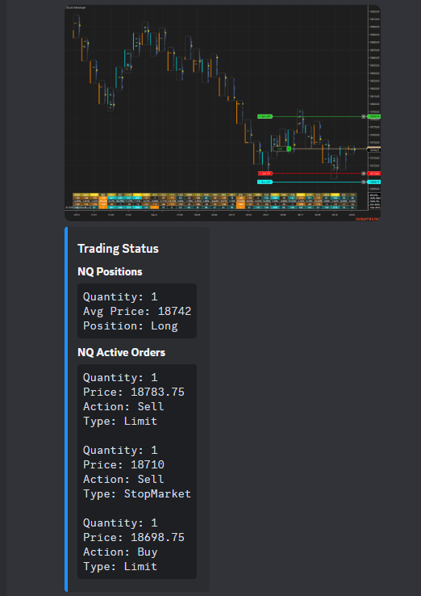

# NinjaTrader Discord Messenger

Share your trades with a discord server. The Discord Messenger automatically takes a screenshot of the chart and sends the account position and active orders to a Discord webhook url everytime an order or position is updated.

# Important

Make sure you have a valid Discord webhook url, which can be setup in the settings section of the server under integrations.

The trading status will only send if you have real-time data. For example, using live data and the playback for Market Replay.

You will need to add this as an indicator in NinjaTrader.

Screenshot - Will only take the screenshot of the last chart that had an updated order. For example, it will send the screenshot of ES if you are trading NQ with Discord Messenger on it and then select a chart with ES for a new position.

# Usage

You'll find the Discord Messenger under the indicators. Enable it similar to how you will enable an indicator. Make sure to update the `Account Name` to the account you want to use to send the messages.

For usage, you can download the release zip in the release page. You can import this zip file similar to importing a normal NinjaTrader Add-On. https://github.com/WaleeTheRobot/ninja-trader-discord-messenger/releases

# Development

For developing, you can copy the DiscordMessenger folder into your local NinjaTrader AddOns folder.

You might have to add a reference in NinjaScript Editor to the below dlls which should be available at `C:\Program Files\NinjaTrader 8\bin`.

- Newtonsoft.Json.dll

# Issues

Sometimes NinjaTrader will complain about an import failed. You can just open the zip file from the release and copy the DiscordMessenger folder into the AddOns folder on your computer after removing the previous DiscordMessenger folder if it exists. It's normally located at: `C:\Users\<username>\Documents\NinjaTrader 8\bin\Custom\AddOns`. Afterwards, open NinjaTrader and click `New` > `NinjaScript Editor`. Click the NinjaScript Editor and press `F5`. It'll take a few seconds and you'll hear a sound. The icon at the bottom left corner of it will disappear when it's done compiling. Close the NinjaScript Editor and you should be good to go.

# Control Panel

### Discord Webhook Status

This checks the status of the webhook every minute. Green indicates that it can successfully connect to it. Yellow indicates that one of the webhook urls failed. Red indicates that there is an issue with all the webhook urls.

#### Adding multiple webhook urls

You'll need to add them without any line breaks for the multiple webhook urls to work. Otherwise NinjaTrader will truncate them when you add them into the field. Example:
https://discord.com/api/webhooks/1287216115734548614/RovsK5e, https://discord.com/api/webhooks/1287507140319379690/gCC8HS, https://discord.com/api/webhooks/1288143475031674901/0ttaQq80, https://discord.com/api/webhooks/1288143558141935751/gZnm4_o3i7Zm, https://discord.com/api/webhooks/1288143628329287782/testsdrfwer

### Auto Send Button

This allows the user to disable the script from automatically sending the trading status and screenshot to the Discord webhook urls.

### Send Trading Status Button

This allows the user to manually send a screenshot and the current position and active orders to the Discord webhook urls.

### Send Screenshot Button

This allows the user to send a screenshot to the Discord webhook urls.

### Recent Events

This is a quick visual to show the last few recent events to the Discord webhook urls.

# Examples

Screenshot displayed with the positions and active orders. Note that the active orders are arranged so it correlates visually with the screenshot.

Multiple instruments are grouped together.
